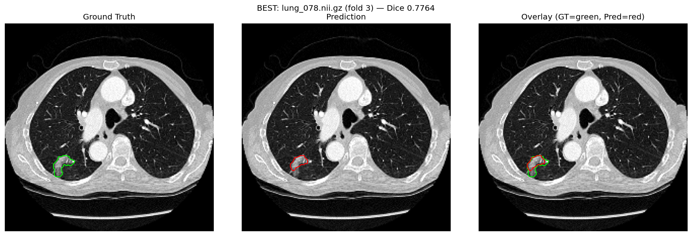
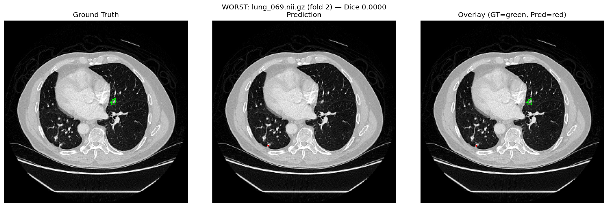

# Lung Tumor Segmentation — 3D U-Net Baseline on MSD Task06

A reproducible baseline for automatic lung tumor segmentation from CT using a standard
3D U-Net (MONAI), evaluated with three-fold cross-validation on the Medical Segmentation
Decathlon Task06 Lung dataset.

This project does not aim to beat state-of-the-art architectures — it establishes a
transparent, fully documented baseline that more advanced methods (attention mechanisms,
transformer-based models, multi-scale fusion) can be fairly compared against.

📄 **Paper:** [link once available]

## Results

Evaluated across all 63 annotated cases via 3-fold cross-validation.

| Metric | Mean ± SD |
|---|---|
| Dice | 0.2876 ± 0.2533 (per-case) |
| IoU | 0.1971 ± 0.2016 |
| HD95 (mm) | 232.84 ± 62.22 |
| Precision | 0.2847 ± 0.2720 |
| Recall | 0.4411 ± 0.3014 |
| Specificity | 0.9997 ± 0.0004 |

| Fold | Mean Dice | Best epoch |
|---|---|---|
| 1 | 0.2569 | 33 |
| 2 | 0.2398 | 46 |
| 3 | 0.3659 | 27 |
| **Overall** | **0.2876 ± 0.0684** (fold-level) | |

Full per-case results: [`results/per_case_metrics.csv`](results/per_case_metrics.csv)

## Example Results

Best case — `lung_078.nii.gz` (Dice 0.7764) vs. worst case — `lung_069.nii.gz` (Dice 0.0000):

Green contour = ground truth, red contour = prediction.

## Method

- **Architecture:** Standard 3D U-Net (MONAI), 5 resolution levels (16→256 channels), 2 residual units per level, dropout 0.05
- **Loss:** DiceCE (Dice weight 0.8, CE weight 0.2)
- **Optimizer:** AdamW, lr 1e-3, weight decay 1e-5, ReduceLROnPlateau (factor 0.5, patience 8)
- **Preprocessing:** Canonical orientation, resampled to 1.5mm isotropic spacing, HU clipped to [-1000, 400], normalized to [0, 1]
- **Augmentation (train only):** Random flips, affine (scale/rotate/translate), gamma, Gaussian noise/blur, bias field
- **Training:** Max 120 epochs, patch-based sampling (64³), early stopping (patience 25), gradient clipping at 1.0
- **Inference:** MONAI sliding-window inference, Gaussian-weighted blending
- **Validation:** 3-fold cross-validation, 21 held-out cases per fold

## Repository Structure

src/
├── data/preprocessing.py # TorchIO transforms, fold loaders
├── models/lightning_module.py # 3D U-Net + PyTorch Lightning module
├── train.py # k-fold training loop
├── evaluate.py # per-case metrics (MONAI-based)
└── visualize.py # qualitative result figures

configs/default.yaml # hyperparameters
results/ # metrics CSV, figures

## Limitations

- Trained on only 63 annotated cases — small for the anatomical variability in lung tumors
- No attention, transformer, or multi-scale modules — intentionally a plain 3D U-Net baseline
- Trained on Google Colab under session/compute constraints — limited hyperparameter search, no ensembling explored
- Not evaluated on an external/out-of-distribution dataset

See the paper's Discussion section for full analysis of failure modes on small, low-contrast tumors.

## Citation

## Data Availability

The MSD Task06 Lung dataset is publicly available from the [Medical Segmentation Decathlon](http://medicaldecathlon.com/). Trained model checkpoints available on request.
